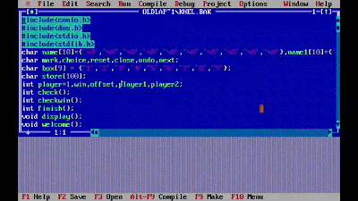

# Tic-Tac-Toe Game

## Overview
Tic-Tac-Toe is a classic two-player game where players take turns marking Xs and Os on a 3x3 grid. The goal is to get three of your marks in a row, column, or diagonal before your opponent.

This game is developed in C using the `conio` and `dos` libraries to handle graphics and game mechanics.

## Features
- **Two-Player Mode**: Play against another player.
- **Simple and Interactive UI**: Built using C's built-in libraries.
- **Win Detection**: The game detects when a player wins or if there’s a draw.
- **Undo & Reset Options**: Players can reset the game or undo moves.

## Installation & Execution
1. **Compile the Game**: Use a C compiler that supports `conio.h` and `dos.h`, such as Turbo C++.
2. **Run the Executable**: After compilation, execute the game in a DOS-compatible environment or an emulator like DOSBox.

## Controls
- **Number Keys (1-9)**: Select a position on the grid.
- **R Key**: Reset the game.
- **U Key**: Undo the last move.
- **Escape (`ESC`)**: Exit the game.

## Requirements
- Turbo C++ (or a compatible compiler)
- DOS-based environment or DOSBox emulator

## How to Play
1. Launch the game.
2. Player 1 (X) and Player 2 (O) take turns choosing a position on the 3x3 grid.
3. The first player to align three marks horizontally, vertically, or diagonally wins.
4. If the grid is full without a winner, the game ends in a draw.
5. Press 'R' to reset the game or 'U' to undo the last move.

## Future Improvements
- AI-based single-player mode.
- Enhanced graphics with external libraries.
- Online multiplayer support.

## Demo
Check out the gameplay demo below:

<video width="640" height="360" controls>
  <source src="demo.gif" type="video/mp4">
  Your browser does not support the video tag.
</video>

## Author
Developed by [Your Name]. Feel free to contribute or suggest improvements!

